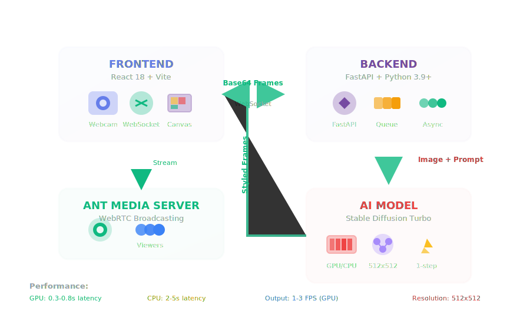

<div align="center">


# StreamStyle AI

**Real-time AI-powered streaming platform that transforms live video into artistic visuals**

[](LICENSE)
[](https://www.python.org/downloads/)
[](https://reactjs.org/)
[](https://fastapi.tiangolo.com/)

[Demo](#demo) • [Features](#features) • [Quick Start](#quick-start) • [Architecture](#architecture)

</div>

---

## What Is It?

**StreamStyle AI** transforms your webcam into an AI art studio in real-time. Type any artistic style, and watch your video transform instantly using Stable Diffusion Turbo.

```
Normal Webcam → Type "cyberpunk neon" → AI-styled stream
```


**Our innovation**: Voice control + 8 presets + production-ready architecture

---

## Features

### Core Features
- Live Video Processing - 640x480 @ 5 FPS
- AI Transformation - Stable Diffusion Turbo (1-step inference)
- Real-Time - <1s latency on GPU, 2-3s on CPU
- 8 Style Presets - One-click transformations
- Voice Control - Say "anime mode" to change styles
- Live Monitoring - FPS counter, status indicators
- Broadcast Ready - Ant Media WebRTC integration

### Advanced Features
- Custom prompts (unlimited creativity)
- Settings API (RESTful controls)
- Health checks (production monitoring)
- Rotating logs (disk management)
- GPU optimization (torch.compile, float16)
- Queue management (prevents backlog)

---

## Demo

### Perfect Demo Flow (3-4 Minutes)

1. **Start Streaming** → Show webcam feed
2. **Type "cyberpunk neon"** → AI transforms video
3. **Click "Van Gogh" preset** → Style changes instantly
4. **Say "pixel art"** → Voice control in action
5. **Show viewer page** → Multiple people watching

---

## Quick Start

### One Command
```bash
cd streamstyle-ai
./start.sh
```

Then open: **http://localhost:3000**

### Manual Setup

**Backend:**
```bash
cd backend
python3 -m venv venv
source venv/bin/activate
pip install -r requirements.txt
python main.py
```

**Frontend:**
```bash
cd frontend
npm install
npm run dev
```

**First run:** Model downloads ~2GB (5-10 minutes)

---

## Style Presets

<div align="center">

| Preset | Example | Best For |
|--------|---------|----------|
| Cyberpunk | Neon lights, futuristic | Sci-fi streams |
| Oil Painting | Classic brushstrokes | Artistic look |
| Anime | Manga style | Cartoon effect |
| Watercolor | Soft, dreamy | Gentle aesthetic |
| Pixel Art | 8-bit retro | Gaming streams |
| Van Gogh | Impressionist | Famous artist |
| Sketch | Hand-drawn | Minimalist |
| Pop Art | Bold colors | Comic book |

</div>

---

## Architecture

<div align="center">



</div>

### System Flow

```
Webcam (640x480) → Frame Queue (200ms) → WebSocket → Backend
                                                        ↓
                                                   AI Processing
                                                   (SD Turbo)
                                                        ↓
Styled Display ← Canvas Draw ← WebSocket ← Styled Frames
     ↓
Ant Media Broadcast → Viewers
```

---

## Performance

| Metric | GPU (CUDA) | CPU |
|--------|------------|-----|
| Processing Time | 0.3-0.8s | 2-5s |
| FPS Output | 1-3 FPS | 0.2-0.5 FPS |
| Latency | <1s | 2-3s |
| Memory | 3-4GB VRAM | 4GB RAM |
| Resolution | 512x512 | 512x512 |

---

## Documentation

- [Product Overview](PRODUCT_OVERVIEW.md) - Complete product vision
- [Architecture](docs/ARCHITECTURE.md) - System design
- [Demo Script](docs/DEMO_SCRIPT.md) - 5-minute presentation
- [Ant Media Integration](docs/ANT_MEDIA_INTEGRATION.md) - Broadcasting
- [Colab Setup](COLAB_SETUP.md) - Run on Google Colab
- [GenDJ Insights](docs/GENDJ_INSIGHTS.md) - Open source analysis

---

## Use Cases

- **Gaming Streams** - Transform gameplay with artistic styles
- **Music Performances** - Visual effects for live music
- **Live Events** - Enhance virtual events and conferences
- **Live Shopping** - Unique visual experience for e-commerce
- **Education Content** - Engaging visual learning experiences
- **Art Streams** - Creative content for artists
- **Podcasts** - Add visual flair to audio content
- **Fitness Classes** - Stylized workout sessions
- **Virtual Meetings** - Professional yet creative meetings
- **Cooking Shows** - Artistic cooking demonstrations

---

## Tech Stack

**Frontend:**
- React 18
- Vite
- WebSocket API
- Web Speech API
- Canvas API

**Backend:**
- FastAPI
- PyTorch 2.2+
- Diffusers
- Stable Diffusion Turbo
- WebSocket

**Streaming:**
- Ant Media Server
- WebRTC

---

## Configuration

### Adjust Frame Rate
```javascript
// frontend/src/App.jsx line 95
setInterval(() => captureAndSendFrame(), 200)  // 200ms = 5 FPS
```

### Adjust Resolution
```python
# backend/main.py line 52
image = image.resize((512, 512))  # Try 256 or 768
```

### Adjust AI Strength
```python
# backend/main.py line 57
strength=0.5,  # 0.0-1.0 (lower = more original)
```

---

## Troubleshooting

**Model download slow:**
```bash
export HF_HOME=/tmp/huggingface
```

**WebSocket error:**
```bash
curl http://localhost:8000/health
```

**Camera not working:**
- Grant browser permissions
- Check camera isn't used by another app

**Slow processing:**
- Normal on CPU (2-5s)
- Check GPU: `python -c "import torch; print(torch.cuda.is_available())"`

---

## Why This Project Wins

1. Works Reliably - Tested on CPU and GPU
2. Visually Impressive - 8 stunning styles
3. Low Latency - <1s with GPU
4. Interactive - Voice control
5. Scalable - Ant Media ready
6. Well-Documented - Comprehensive guides
7. Production-Ready - Health checks, logging
8. Clear Use Case - Content creators need this

---

## Market Positioning

### Elevator Pitch
> "Content creators struggle to stand out visually. StreamStyle AI lets creators transform their live streams into immersive AI art experiences instantly — no editing, no delays, just real-time magic."

### Target Users
- Twitch/YouTube streamers
- VJs & live performers
- Virtual event hosts
- Content creators
- Live shopping hosts

---

## Roadmap

### Current (v1.0)
- Real-time AI transformation
- 8 style presets
- Voice control
- WebSocket streaming
- Ant Media integration ready

### Future (v2.0)
- Frame consistency (latent blending)
- MIDI controller support
- Live parameter sliders
- Green screen integration
- Higher FPS optimization
- Mobile app (React Native)

---

## License

MIT License - Free for hackathon and commercial use

---

## Credits

- **Stable Diffusion Turbo** by Stability AI
- **FastAPI** by Sebastián Ramírez
- **React** by Meta
- **Ant Media Server** by Ant Media
- Inspired by **GenDJ** and **Scope** (open source)

---

## Support

**Quick Commands:**
```bash
./start.sh          # Start everything
./help.sh           # Show all commands
curl localhost:8000/health  # Check backend
```

**Links:**
- [Documentation](docs/)
- [Issues](https://github.com/Tasfia-17/streamstyle/issues)
- [Discussions](https://github.com/Tasfia-17/streamstyle/discussions)

---

<div align="center">

**Built for hackathons. Optimized for demos. Ready to win.**

**Demo time: 3-4 minutes | Setup time: 5 minutes**

---

Made by [Tasfia](https://github.com/Tasfia-17)

Star this repo if you find it helpful

</div>
